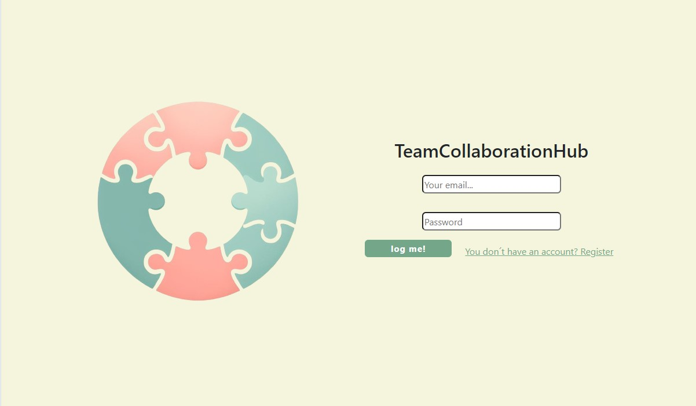
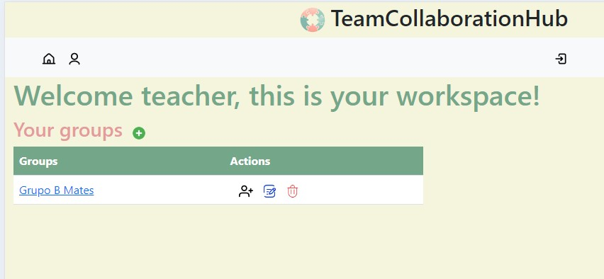
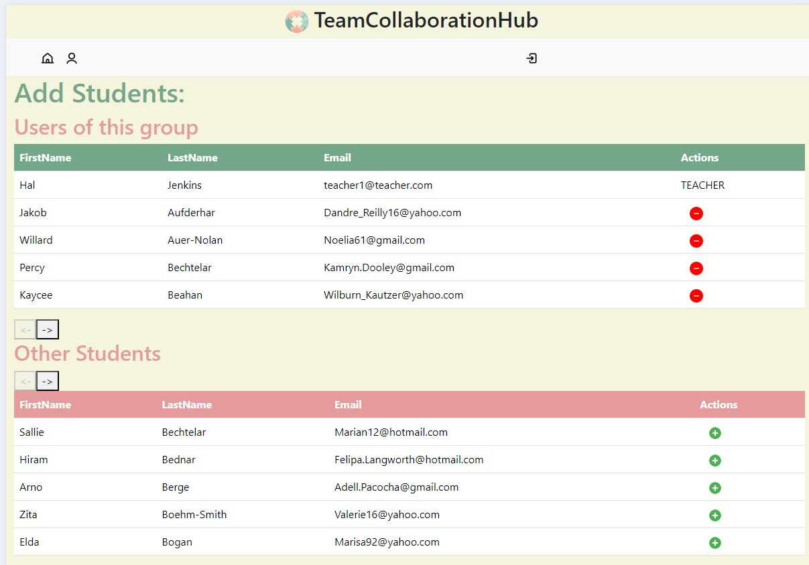
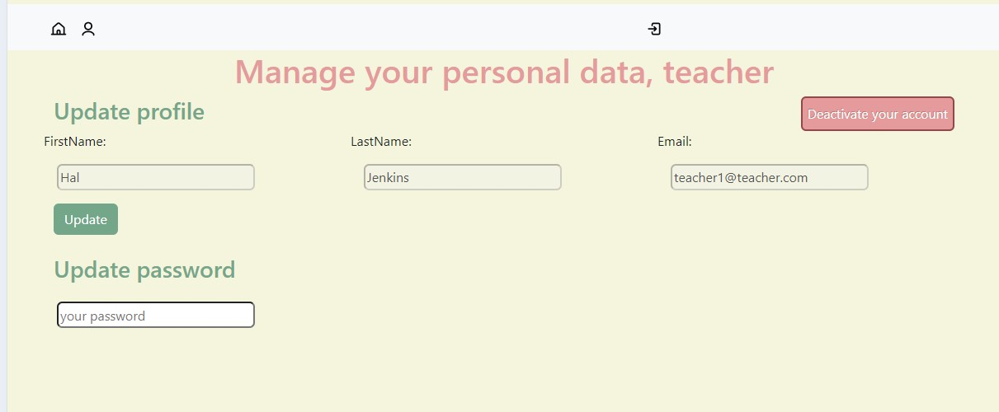
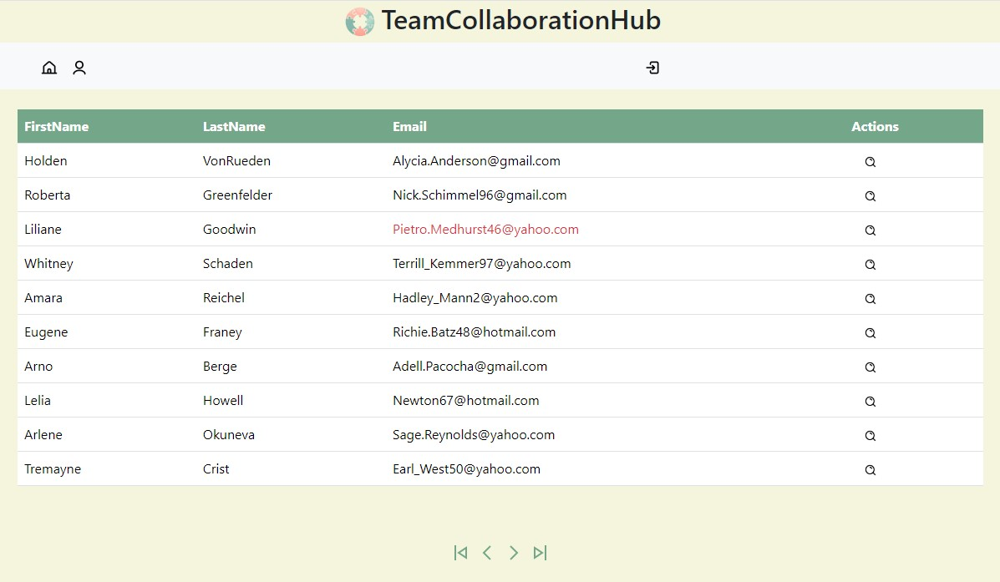
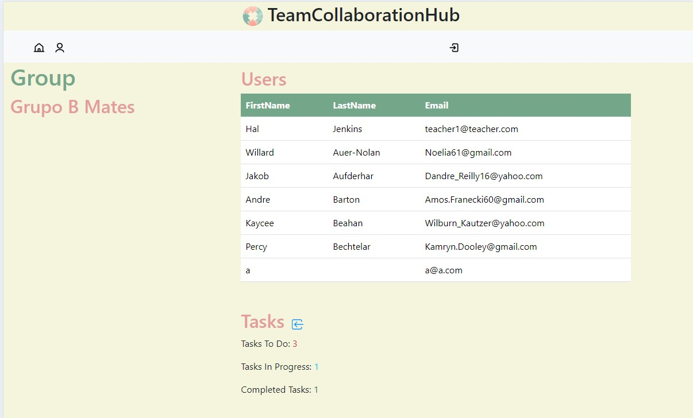
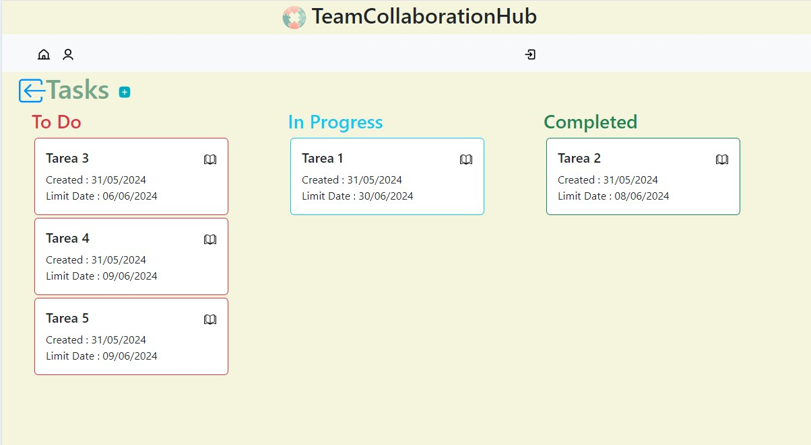

# Frontend app
<div align="center">
  
</div>
<div align="center">TeamCollaborationHub</div>
<br></br>
<a href="https://www.linkedin.com/in/richard-sanz-gadea-2270101aa/" target="_blank"></a>
<br></br>
<details>
  <summary>Contenido 📝</summary>
  <ol>
    <li><a href="#objetivo">Objetivo</a></li>
    <li><a href="#sobre-el-proyecto">Sobre el proyecto</a></li>
    <li><a href="#stack">Stack</a></li>
    <li><a href="#instalación-en-local">Instalación</a></li>
    <li><a href="#vistas">Vistas</a></li>
    <li><a href="#mejoras">Mejoras</a></li>
    <li><a href="#licencia">Licencia</a></li>
    
  </ol>
</details>

## Objetivo
Crear una web funcional sobre una aplicación para organización y seguimiento de grupos de trabajo en un centro educativo.

## Sobre el proyecto
En este proyecto, como profesores, podemos gestionar grupos (crear,añadir/elminar alumnos, borrar y visualizar información). Como estudiantes podemos visualizar información acerca del grupo y gestionar tareas asociadas a ese grupo (crear,modificar,borrar). Y como administradores podemos gestionar tanto usuarios como grupos. 
Cada usuario dispondrá de una cuenta o perfil en el que pueda actualizar sus datos introducidos en el registro inicial.

## Stack
Tecnologías utilizadas:
<div align="center">
    <a href="https://www.reactjs.com/">
        
    </a>
    <a href="https://developer.mozilla.org/es/docs/Web/JavaScript">
        
    </a>
</div>

## Instalación en local
1. Clonar el repositorio
2. ` $ npm install `
3. ``` $ npm run dev ```

## Vistas
<br></br>

<div>
<p align="center">
 
</div> 

<div>
<p align="center">

</div>

<div>
<p align="center">


</div>

<div>
<p align="center">


</div>


<div>
<p align="center">


</div>


## Mejoras
✅ Añadir foro de conversación por grupo de trabajo existente.

✅ Envío de correo electrónico de recordatorio de tarea.

✅ Añadir calendario marcando días de finalización de tarea.

✅ Añadir comentarios tarea.

✅ Modificar estilos app.

## Licencia
